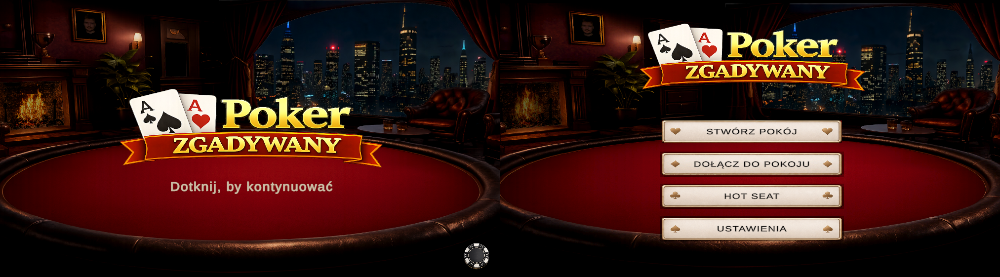
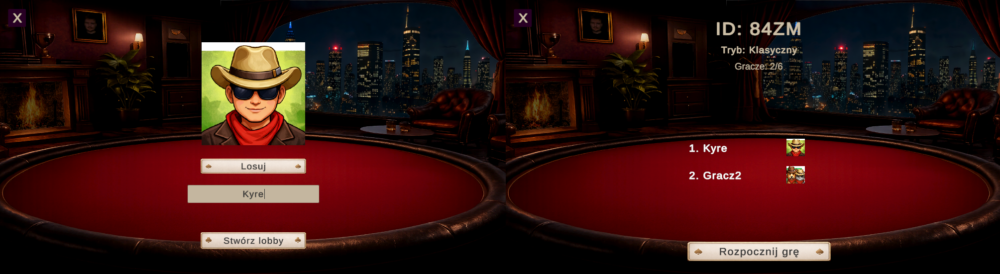
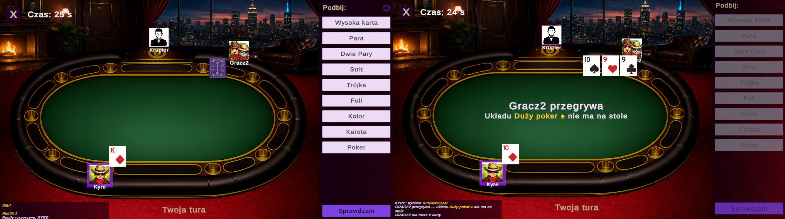
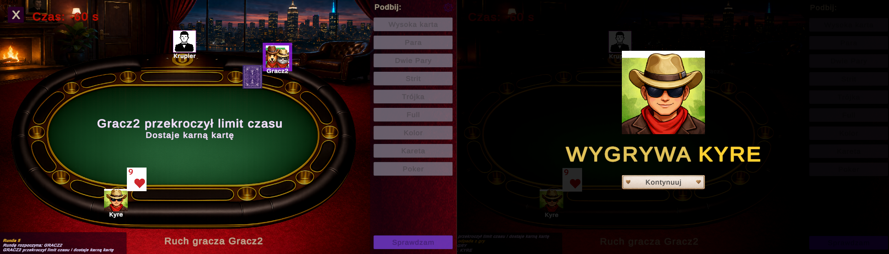

# Poker Guessing Game

A Unity card game prototype based on bluffing, guessing and poker-style hand ranking.

The game is inspired by a local card game concept where players declare increasingly stronger poker hands, while other players can challenge the declaration by choosing "Check". The core gameplay is focused on bluffing, memory, risk and reading other players.

## Current features

- Online multiplayer prototype
- Room creation and joining system
- Player lobby
- Turn-based gameplay logic
- Poker-style hand declaration system
- "Check" mechanic for verifying declared hands
- Round log / in-game chat-style history
- Custom 24-card deck using ranks 9, 10, J, Q, K, A
- Card dealing and reveal flow
- Player avatars
- Loading screen
- Early Hot Seat mode prototype for local offline play

### Online mode

Players can create or join a room and play together online.

### Hot Seat mode

A local offline mode where players share one device. Each player checks their own card/cards privately, then the game continues verbally between players.

## Technologies

- Unity
- C#
- TextMesh Pro
- Photon PUN 2 for online multiplayer

## Important note about Photon

Photon PUN 2 is not included in this public repository.

To run the online multiplayer version, import Photon PUN 2 into the Unity project and configure your own Photon App ID.

The project scripts reference Photon classes, so the project may not compile correctly until Photon PUN 2 is imported.

## Project status

This project is still in development.  
It is a prototype created for learning, portfolio building and testing multiplayer gameplay ideas.

## Author

Created by Eryk Potocki.